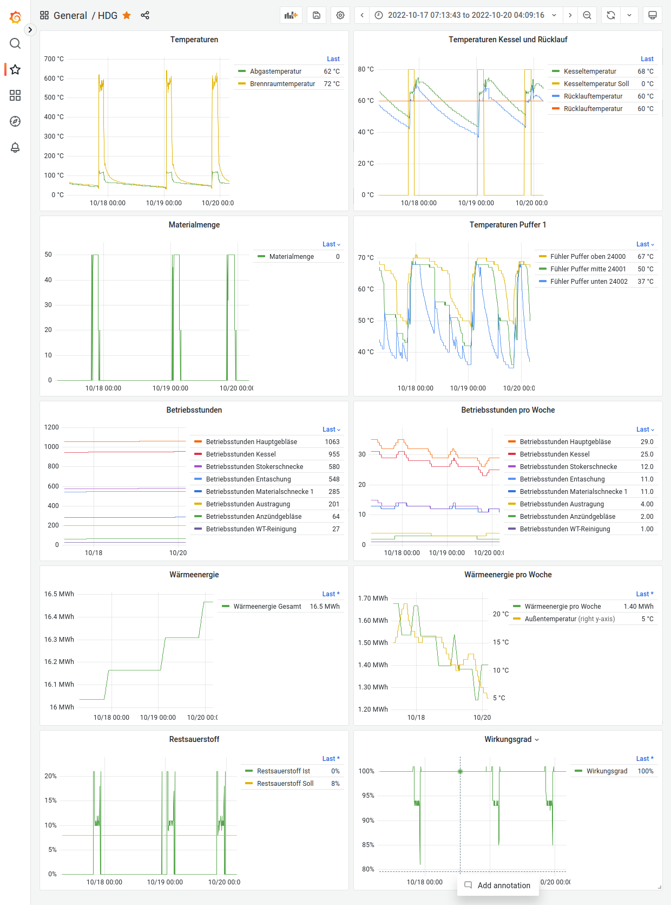

# hdg-exporter

Prometheus exporter for HDG Bavaria heating systems.

## Docker

A docker image is is available at `ghcr.io/srt/hdg-exporter`.
You can find a sample `docker-compose.yml` with Prometheus, Grafana and hdg-exporter in the `samples` subdirectory.
Just update the `HDG_ENDPOINT` environment variable.

## Configuration

HDG Exporter is configured via environment variables. The following variables are supported:

| Variable       | Description                                                                                                                                              | Example               |
| -------------- | -------------------------------------------------------------------------------------------------------------------------------------------------------- | --------------------- |
| `HDG_ENDPOINT` | URL of the heating system.                                                                                                                               | `http://192.168.1.10` |
| `HDG_LANGUAGE` | One of `dansk`, `deutsch`, `english`, `franzoesisch`, `italienisch`, `niederlaendisch`, `norwegisch`, `polnisch`, `schwedisch`, `slowenisch`, `spanisch` | `deutsch`             |
| `HDG_IDS`      | Comma separated list of ids to export. Can be obtained from the Web UI or from [data.json](data.json).                                                   |                       |

## Grafana Dashboard

The [Dashboard](sample/grafana/provisioning/dashboards/HDG.json) can be imported into Grafana.
